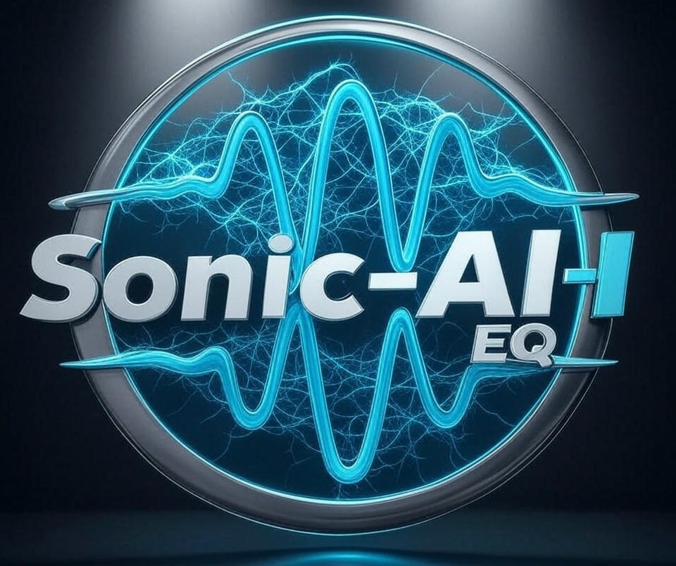

# Sonic-AI-EQ

Designing an AI-driven equalizer app involves integrating frontend, backend, AI modeling, and audio processing. Below is a structured end-to-end plan:

### **1. High-Level Architecture**
#### **Components**:
1. **Frontend**: User interface for uploading songs, adjusting preferences, and viewing results.
2. **Backend**: Handles audio processing, AI inference, and storage.
3. **AI Model**: Analyzes audio and predicts optimal EQ settings.
4. **Audio Engine**: Applies EQ adjustments using DSP.

---

### **2. Tech Stack**
#### **Frontend**:
- **Framework**: React.js (web) or Flutter (mobile).
- **Features**: File upload, waveform visualization, EQ curve display, and download links.
- **Libraries**: Wavesurfer.js (audio visualization), Axios (API calls).

#### **Backend**:
- **Framework**: Flask/Django (Python) or Node.js.
- **Services**:
  - **File Handling**: FastAPI for async uploads/downloads.
  - **Task Queues**: Celery + Redis/RabbitMQ for processing jobs.
  - **Cloud Storage**: AWS S3 or Firebase for storing audio files.
  - **APIs**: REST or GraphQL for communication.

#### **AI/ML**:
- **Framework**: PyTorch/TensorFlow.
- **Data Pipeline**: Librosa (audio feature extraction), Pandas (data preprocessing).
- **Model**: Hybrid architecture (CNN for spectrograms + LSTM for temporal features).
- **Training Data**: 
  - Synthetic dataset with EQ adjustments (e.g., random gains applied, model trained to recover flat EQ).
  - Partner with sound engineers to label tracks with "ideal" EQ settings.

#### **Audio Processing**:
- **DSP**: Librosa (Python) for prototyping; PortAudio or JUCE (C++) for real-time.
- **Formats**: FFmpeg for conversion (WAV, MP3).
- **EQ Implementation**: Parametric EQ using biquad filters or FIR/IIR filters.

### **3. Step-by-Step Workflow**
1. **User Upload**:
   - Frontend accepts audio files (MP3, WAV).
   - Backend validates and stores the file in cloud storage.

2. **Audio Analysis**:
   - Convert audio to mono/WAV for processing.
   - Extract features (MFCCs, spectral contrast, tempo, RMS energy) using Librosa.

3. **AI Inference**:
   - Preprocess features (normalization, PCA).
   - Model predicts EQ gains for 10 frequency bands (e.g., 32Hz–16kHz).

4. **Apply EQ**:
   - Use DSP library to apply gains to each band.
   - Mix processed audio and export to desired format.

5. **User Feedback**:
   - Allow users to rate adjustments (thumbs up/down) for model fine-tuning.

---

### **4. AI Model Design**
#### **Data Preparation**:
- **Ideal EQ Settings**: Partner with audio engineers to label tracks or use reference tracks from platforms like TRAKTOR.
- **Synthetic Data**: Generate variations by applying random EQ curves to songs and train the model to revert to a "neutral" state.

#### **Model Architecture**:
- **Input**: Spectrogram (mel-scaled) + temporal features (BPM, RMS).
- **Architecture**:
  - **CNN Branch**: Processes spectrograms (ResNet-18 pretrained on AudioSet).
  - **LSTM Branch**: Processes time-series features (tempo, energy).
  - **Fusion**: Concatenate outputs, add dense layers for regression (10 output neurons for gains).

#### **Training**:
- **Loss Function**: MSE between predicted and target gains.
- **Optimization**: AdamW with learning rate scheduling.
- **Augmentation**: Add noise, pitch shifts, and time-stretching.

---

### **5. Audio Processing Pipeline**
1. **Band Splitting**:
   - Split audio into 10 bands using Butterworth filters.
2. **Gain Application**:
   - Apply predicted gains per band.
   - Use overlap-add method to avoid artifacts.
3. **Mixing**:
   - Sum all bands and normalize output.

---

### **6. Deployment & Scaling**
- **Backend**: Deploy on AWS EC2 (GPU instances for inference) or Kubernetes cluster.
- **Edge Processing**: Use ONNX/TFLite for mobile-optimized models.
- **Latency Mitigation**: Cache frequent requests, precompute features.

---

### **7. Challenges & Solutions**
- **Subjectivity of "Best" EQ**: Collect user feedback to personalize models (e.g., collaborative filtering).
- **Real-Time Processing**: Optimize DSP code with C++ bindings (pybind11) or WebAssembly.
- **Data Scarcity**: Use transfer learning (pretrain on music classification tasks).

---
